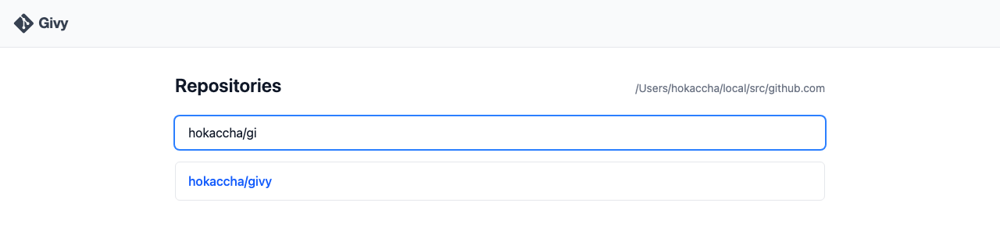
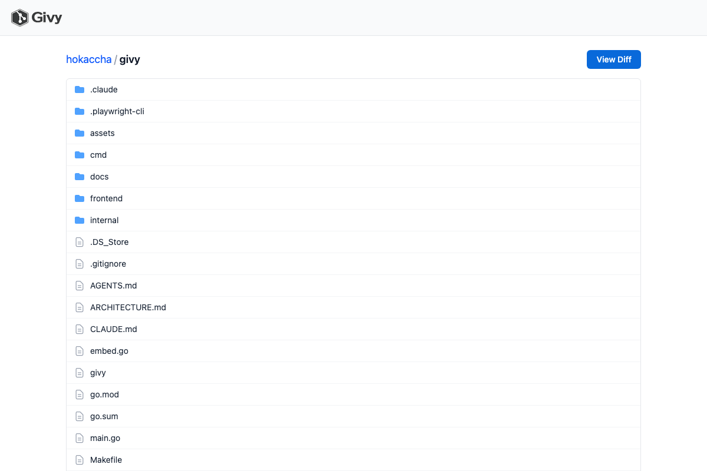
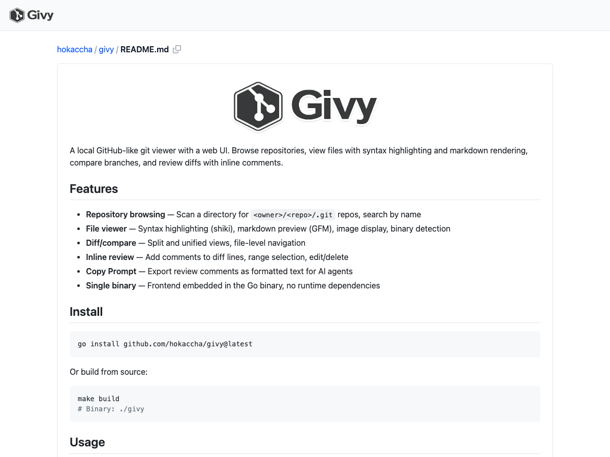
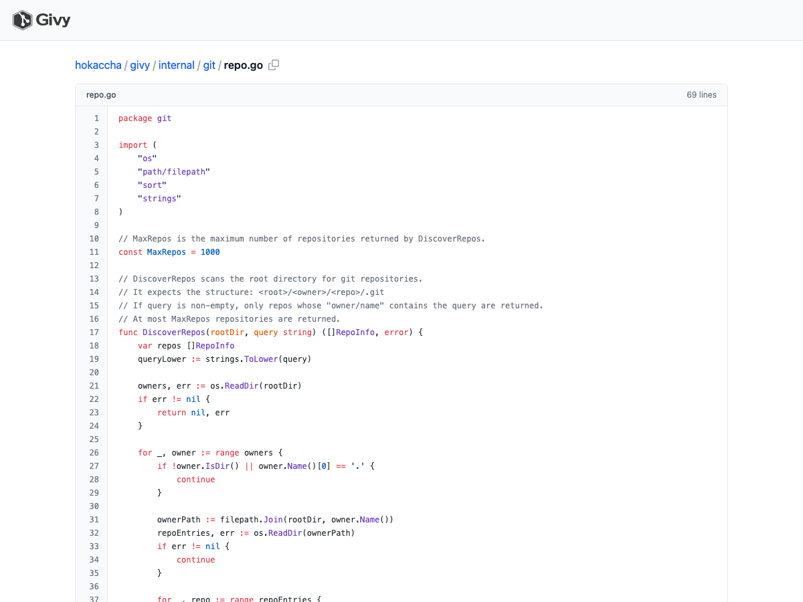
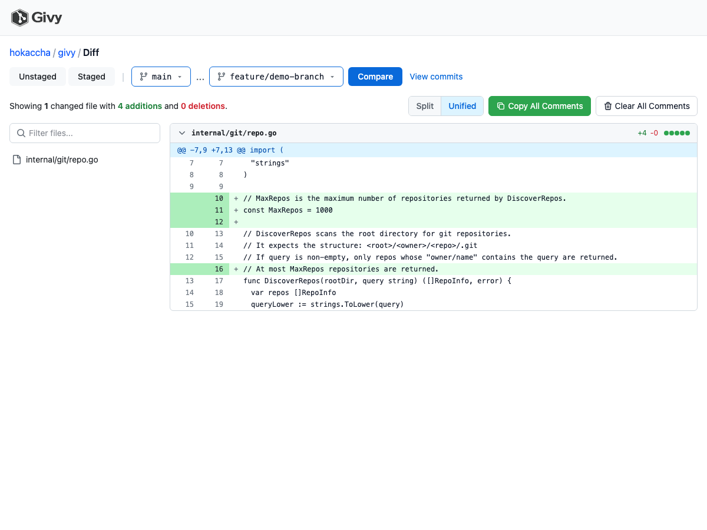
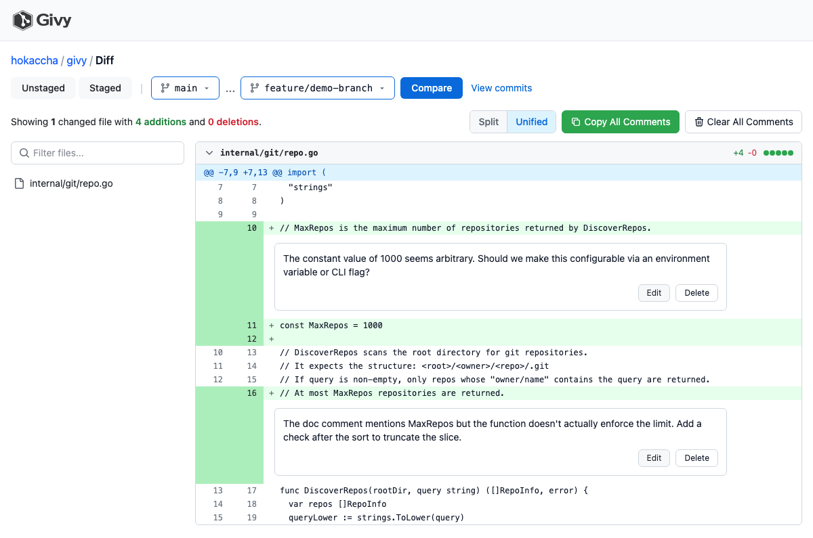
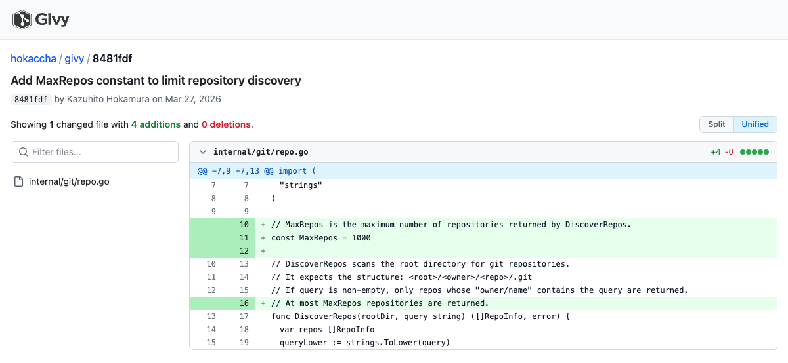
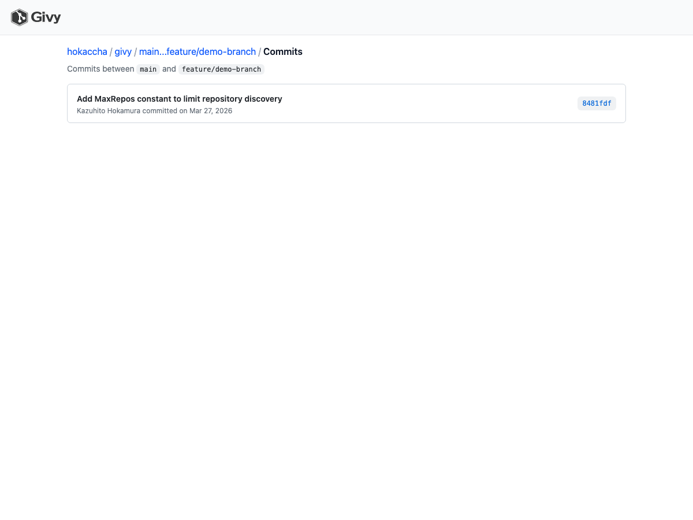

<p align="center">
  
</p>

A local GitHub-like git viewer with a web UI. Browse repositories, view files with syntax highlighting and markdown rendering, compare branches, and review diffs with inline comments.

## Features

- **Repository browsing** — Scan a directory for `<owner>/<repo>/.git` repos, search by name
- **File viewer** — Syntax highlighting (shiki), markdown preview (GFM), image display, binary detection
- **Diff/compare** — Split and unified views, file-level navigation
- **Inline review** — Add comments to diff lines, range selection, edit/delete
- **Copy Prompt** — Export review comments as formatted text for AI agents
- **Working directory changes** — View unstaged/staged diffs directly
- **Single binary** — Frontend embedded in the Go binary, no runtime dependencies

## Install

```bash
go install github.com/hokaccha/givy@latest
```

Or install with [mise](https://mise.jdx.dev/):

```bash
mise use github:hokaccha/givy@latest
mise install github:hokaccha/givy@latest
```

Or build from source:

```bash
make build
# Binary: ./givy
```

## Quick Start

### 1. Start the server

Point givy at a directory containing your git repositories. Givy expects the structure `<root>/<owner>/<repo>/.git`:

```bash
givy serve ~/src
# Serves repos found at ~/src/<owner>/<repo>/.git
# Open http://localhost:6271
```

Options:

| Flag | Default | Description |
|------|---------|-------------|
| `--port` | `6271` | Port to listen on (env: `GIVY_PORT`) |

### 2. Browse repositories

Open `http://localhost:6271` in your browser. You'll see a list of all discovered repositories with incremental search.



Click a repository to open the file browser.

### 3. Browse files

The file browser shows the current working directory state (not a specific git ref). Directories and files are listed with icons, and you can navigate through the tree by clicking.



### 4. View files

Click any file to view it. Givy automatically detects the file type and renders accordingly:

- **Source code** — Syntax highlighted with shiki, with line numbers
- **Markdown** — Rendered as HTML with GFM support (tables, task lists, etc.)
- **Images** — Displayed inline
- **Binary files** — Shows file size and a download notice





## Diff and Review

The core feature of givy is reviewing diffs with inline comments, similar to GitHub's pull request review.

### View branch diffs

From the repository page, click the **"View Diff"** button to open the changes view. Use the branch selectors to compare any two branches.



The diff view provides:

- **Split and unified views** — Toggle between side-by-side and inline diff formats
- **File navigation** — File list sidebar for quick jumping between changed files
- **Inline comments** — Click the `+` icon on any diff line to add a review comment
- **Range selection** — Select multiple lines to comment on a code range
- **Edit and delete** — Manage your comments directly in the diff view
- **Copy Prompt** — Export all comments as formatted text, useful for feeding back to AI coding agents
- **Clear All Comments** — Remove all comments at once when starting a new review

### Inline review comments

Click the `+` icon in the gutter to add a comment on any line. Comments are stored in your browser's localStorage and persist across page reloads.



### Copy Prompt for AI agents

After writing review comments, click **"Copy All Comments"** to copy all comments as a structured prompt. The output includes file paths, line numbers, and your review text — ready to paste into an AI coding agent (e.g., Claude Code, Cursor, Copilot) for automated fixes.

Example output:

```markdown
## internal/git/repo.go

- **Line 10** (right): The constant value of 1000 seems arbitrary. Should we make this configurable?
- **Line 16** (right): The doc comment mentions MaxRepos but the function doesn't actually enforce the limit.
```

### View working directory changes

The changes view also supports viewing unstaged and staged changes directly, with tabs at the top:

- **Unstaged** — Shows uncommitted, unstaged changes (`git diff`)
- **Staged** — Shows staged changes (`git diff --cached`)

### View commit diffs

Click a commit hash to see the diff for a single commit:



### View commit list

When comparing branches, click **"View commits"** to see the list of commits between the two refs:



## CLI Commands

### `givy serve <directory>`

Start the web server.

```bash
givy serve ~/src
givy serve --port 8080 ~/src
```

### `givy open <path | commit-id>`

Open a file, directory, or commit in the browser. Requires a running `givy serve` instance.

```bash
# Open a file
givy open ~/src/hokaccha/givy/internal/git/repo.go

# Open a directory
givy open ~/src/hokaccha/givy/internal/

# Open a commit diff
givy open abc1234
```

Givy automatically infers the root directory from the file path. Use `--root` to specify it explicitly.

### `givy diff [spec]`

Open the diff view in the browser. Requires a running `givy serve` instance. Run this from inside a repository directory.

```bash
# Compare current branch against default branch
givy diff

# Show unstaged changes
givy diff @unstaged

# Show staged changes
givy diff @staged

# Compare a specific branch against the default branch
givy diff feature/new-ui

# Explicit base...head
givy diff main...feature/new-ui
```

## Configuration

| Environment Variable | Default | Description |
|---------------------|---------|-------------|
| `GIVY_PORT` | `6271` | Server port (also used by `open` and `diff` commands) |
| `GIVY_ROOT_DIR` | — | Root directory (used by `open` and `diff` commands as default `--root`) |

## Inspiration

This project is inspired by and references the following tools:

- [mo](https://github.com/k1LoW/mo) — A Git-centric and AI-readable and writable code review tool
- [difit](https://github.com/yoshiko-pg/difit) — Local diff viewer for Git

## License

MIT
