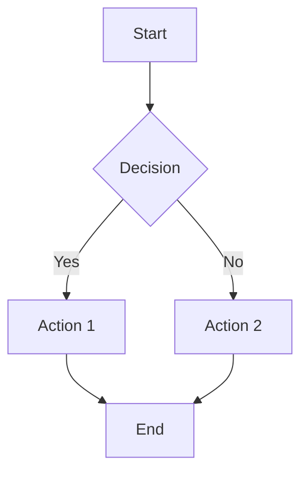
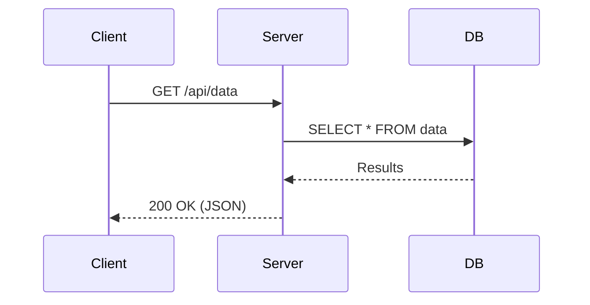
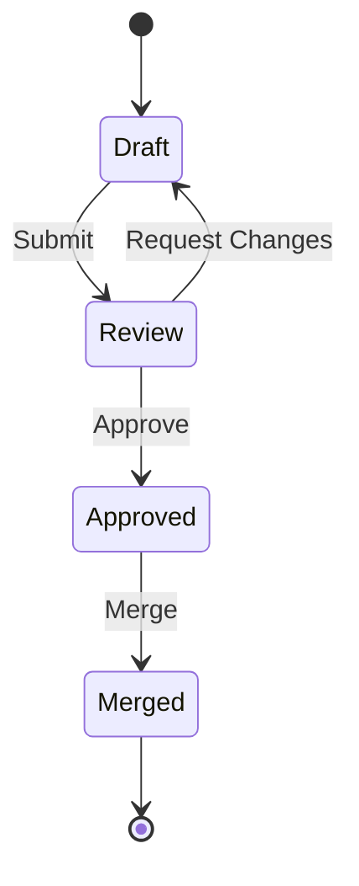

# Markdown Preview Test

This file covers all supported markdown rendering features for visual verification.

## Headings

# Heading 1
## Heading 2
### Heading 3
#### Heading 4
##### Heading 5
###### Heading 6

## Inline Formatting

This is **bold**, this is *italic*, this is ***bold and italic***.

This is ~~strikethrough~~ text.

This is `inline code` within a sentence.

## Links

- [External link](https://github.com)
- [Link with title](https://github.com "GitHub")
- Autolink: https://github.com

## Images


## Paragraphs and Line Breaks

This is the first paragraph. It has multiple sentences to show how paragraph text wraps and flows naturally within the markdown viewer.

This is the second paragraph, separated by a blank line.

This line has a hard break  
right here (two trailing spaces).

---

## Lists

### Unordered List

- Item 1
- Item 2
  - Nested item 2a
  - Nested item 2b
    - Deeply nested
- Item 3

### Ordered List

1. First item
2. Second item
   1. Nested numbered item
   2. Another nested item
3. Third item

### Task List

- [x] Completed task
- [ ] Incomplete task
- [x] Another completed task
- [ ] Another incomplete task

## Blockquotes

> This is a blockquote.
>
> It can span multiple paragraphs.

> Nested blockquote:
>
> > This is nested inside.

## GitHub Alerts

> [!NOTE]
> Useful information that users should know, even when skimming content.

> [!TIP]
> Helpful advice for doing things better or more easily.

> [!IMPORTANT]
> Key information users need to know to achieve their goal.

> [!WARNING]
> Urgent info that needs immediate user attention to avoid problems.

> [!CAUTION]
> Advises about risks or negative outcomes of certain actions.

### Alerts with Rich Content

> [!NOTE]
> Alerts can contain **bold**, *italic*, and `inline code`.
>
> They can also have multiple paragraphs.

> [!TIP]
> Alerts can contain lists:
>
> - Item one
> - Item two
> - Item three

> [!WARNING]
> Alerts can contain code blocks:
>
> ```bash
> echo "Be careful with this command"
> rm -rf /tmp/test
> ```

> [!IMPORTANT]
> Alerts can contain [links](https://github.com) and other inline elements like ~~strikethrough~~.

## Code Blocks

### JavaScript

```javascript
function fibonacci(n) {
  if (n <= 1) return n;
  return fibonacci(n - 1) + fibonacci(n - 2);
}

const result = fibonacci(10);
console.log(`Fibonacci(10) = ${result}`);
```

### TypeScript

```typescript
interface User {
  id: number;
  name: string;
  email: string;
}

function greet(user: User): string {
  return `Hello, ${user.name}!`;
}
```

### Go

```go
package main

import "fmt"

func main() {
    ch := make(chan string)
    go func() {
        ch <- "Hello from goroutine"
    }()
    msg := <-ch
    fmt.Println(msg)
}
```

### Python

```python
from dataclasses import dataclass

@dataclass
class Point:
    x: float
    y: float

    def distance(self, other: "Point") -> float:
        return ((self.x - other.x) ** 2 + (self.y - other.y) ** 2) ** 0.5
```

### Shell

```bash
#!/bin/bash
for file in *.md; do
  echo "Processing: $file"
  wc -l "$file"
done
```

### JSON

```json
{
  "name": "givy",
  "version": "1.0.0",
  "features": ["markdown", "git", "diff"],
  "config": {
    "theme": "light",
    "enabled": true
  }
}
```

### CSS

```css
.container {
  display: grid;
  grid-template-columns: repeat(auto-fit, minmax(250px, 1fr));
  gap: 1rem;
  padding: 2rem;
}
```

### Plain (no language)

```
This is a plain code block
without any syntax highlighting.
It should still have a copy button.
```

## Tables

### Simple Table

| Feature | Status | Notes |
|---------|--------|-------|
| Headings | Done | H1-H6 |
| Lists | Done | UL, OL, Task |
| Code Blocks | Done | With highlighting |
| Tables | Done | GFM tables |

### Aligned Table

| Left | Center | Right |
|:-----|:------:|------:|
| L1 | C1 | R1 |
| L2 | C2 | R2 |
| L3 | C3 | R3 |

### Wide Table

| Column 1 | Column 2 | Column 3 | Column 4 | Column 5 | Column 6 |
|----------|----------|----------|----------|----------|----------|
| Data | Data | Data | Data | Data | Data |
| More data | More data | More data | More data | More data | More data |

## Horizontal Rules

Above the rule.

---

Between rules.

***

Below the rule.

## Math (KaTeX)

### Inline Math

The quadratic formula is $x = \frac{-b \pm \sqrt{b^2 - 4ac}}{2a}$ where $a \neq 0$.

Euler's identity: $e^{i\pi} + 1 = 0$.

### Display Math

$$
\int_{-\infty}^{\infty} e^{-x^2} dx = \sqrt{\pi}
$$

$$
\sum_{n=1}^{\infty} \frac{1}{n^2} = \frac{\pi^2}{6}
$$

$$
\nabla \times \mathbf{E} = -\frac{\partial \mathbf{B}}{\partial t}
$$

### Math Code Block

```math
\begin{pmatrix}
a & b \\
c & d
\end{pmatrix}
\begin{pmatrix}
x \\
y
\end{pmatrix}
=
\begin{pmatrix}
ax + by \\
cx + dy
\end{pmatrix}
```

## Mermaid Diagrams

### Flowchart



### Sequence Diagram



### State Diagram



## HTML (Raw)

<details>
<summary>Click to expand</summary>

This is content inside a collapsible HTML section.

- It supports **markdown** inside.
- And lists too.

</details>

<div align="center">
  <strong>Centered text using HTML</strong>
</div>

## Edge Cases

### Empty Code Block

```
```

### Long Unbroken Line

`this_is_a_very_long_variable_name_that_might_cause_horizontal_scrolling_in_the_code_viewer_component_and_should_be_handled_gracefully`

### Special Characters in Code

```html
<div class="container">
  <p>Hello &amp; welcome</p>
   image" />
</div>
```

### Nested Formatting

> **Bold in blockquote** with `code` and *italic*
>
> - List inside blockquote
> - With [links](https://example.com)

### Consecutive Code Blocks

```js
const a = 1;
```

```js
const b = 2;
```

### Table with Code

| Method | Example |
|--------|---------|
| GET | `fetch("/api/data")` |
| POST | `fetch("/api/data", { method: "POST" })` |
